# 基于STL分解与双域周期检测的并行TimesNet光伏功率预测模型

## 摘要

光伏出力的间歇性与波动性给电网调度带来挑战，准确的功率预测是应对该挑战的关键。光伏序列以日周期为主要成分，不同日期中同一相位的出力高度相关，因此周期建模的准确性直接决定预测性能。本文提出并行STL-双域TimesNet（PA-STL-DualTimesNet）模型，在周期建模的三个环节上分别改进：输入端采用STL分解将功率序列拆分为趋势、季节与残差分量，以缓解序列的非平稳性；周期检测环节引入离散余弦变换（DCT）与快速傅里叶变换（FFT）构成双域检测，二者给出两组互补的周期候选，以降低单一变换的栅格离散性对二维折叠的影响；跨周期聚合环节将Autoformer编码器与TimesNet的二维卷积分支并行设置，前者在原始时间轴上按相关谱聚合跨周期的同相位信息，后者在折叠域中提取周期内与近邻周期间模式，二者输出沿特征维拼接后经全连接层融合。模型在两个真实光伏数据集上与九类基准模型对比，并按季节与日波动强度分组评估，结果表明模型的相对增益随工况波动性的增强而增大。

**关键词**：光伏功率预测；STL分解；TimesNet；Autoformer编码器；并行结构

## 1 引言

太阳能因储量丰富、应用灵活而成为发展最快的可再生能源之一[1]。光伏（PV）技术将太阳辐射转化为电能，但其出力受天气波动影响，具有间歇性与随机性，给电网稳定与调度带来挑战[2]。因此，准确的功率预测对电网稳定运行与优化调度具有重要意义。

按预测时间跨度，光伏功率预测可分为超短期、短期与中长期[3]。本文聚焦数小时至数天跨度的预测：该尺度上周期结构与趋势变化同时显著，对模型的周期建模能力要求较高。该尺度上的长期依赖具有明确结构，而非任意两点之间的关联：相隔整数个周期的同相位点（如同一日内的相同时刻在不同日期上对应的点）之间高度相关，而与同一周期内相邻时刻的关联相对较弱。因此，建模该依赖的核心在于显式表达"跨周期同相位"这一先验，而非一般意义上的长序列建模能力。

光伏功率预测方法可分为物理方法、传统统计方法、人工智能方法与混合方法[3]。物理方法需要大量气象与组件参数，受地理条件限制[4]；传统统计方法（回归分析、自回归移动平均与灰色理论）擅长捕捉周期性，但难以处理非线性变化[5]；机器学习方法（随机森林、支持向量回归、XGBoost、LightGBM）提升了对非线性的拟合能力，但对时间依赖的刻画不足[6]。

深度学习方法弥补了上述不足，近期研究多采用混合结构，将卷积网络、循环网络与注意力机制加以组合，以同时利用各类模型的建模能力[7]。针对光伏多步预测，已有工作将TimesNet与增强特征提取及专用损失函数结合[8]，或采用分解—重构—集成的多尺度框架处理波动[9]。在分解策略方面，近年还出现了自适应分解与物理一致性约束相结合的混合网络[10]、二次分解策略[11]，以及变分模态分解与循环网络、注意力机制的组合[12]；TwinS[13]则重新审视了多变量时序中的非平稳性建模。这些工作共同说明：显式分离趋势与周期成分是应对非平稳性的有效途径，但分解方式本身仍在演进。

在周期建模方面，TimesNet[14]将一维序列沿周期方向折叠为二维张量，并以二维卷积提取周期内模式，在多个基准上表现优异；然而其周期检测仅依赖FFT，且跨周期聚合受卷积核大小限制。频域方法已被广泛研究，FEDformer[15]、FreTS[16]与FITS[17]等均在频域或频率增强的表示上建模；近两年的Dualformer[18]与FMDformer[19]进一步探索了时频双域学习与频率混合分解，说明频域建模仍是活跃方向[20]。此外，MoFo[21]与PENGUIN[22]分别从周期性模式建模与周期分组注意力出发改进长期时序预测，TimeMixer++[23]则通过多尺度混合处理不同频率的分量，表明周期结构仍是长期时序预测的核心关注点。PatchTST[24]将序列切分为片段后以Transformer建模，代表片段化的处理方案；Zeng等[25]则以线性基线质疑了复杂模型的必要性。自相关机制由Autoformer[26]提出，但通常与该模型的编码器-解码器结构紧密耦合。STL[27]将序列分解为趋势、季节与残差分量，但需逐序列迭代求解、不可微分，难以嵌入端到端训练。

综上，现有工作存在以下不足：（1）周期检测多依赖单一变换，未考虑频率栅格离散性的影响；（2）跨周期聚合缺乏具有明确长滞后语义的机制；（3）分解模块多为逐序列实现，难以批量并行。

在模型组合方式上，现有混合模型多采用串行结构，即后序模块以前序模块的输出为输入。这一方式在本任务中存在局限：若将二维卷积与长滞后聚合串行连接，自相关的输入将建立在已被折叠压缩的表示上，其所需的原始滞后结构不再存在。并行组合（文献[28]–[29]中已有应用）可避免该问题，但尚未与周期建模中的双域检测相结合。

针对上述问题，本文的主要贡献如下：

（1）采用STL分解将光伏功率分解为趋势、季节与残差分量，由三个参数独立的嵌入网络分别表示；并以向量化可微实现替代逐序列LOESS，使分解可批量并行。

（2）在周期检测环节引入DCT与FFT构成双域检测，利用两者频率栅格（2T/k与T/k）的差异，提供两组互补的周期候选。

（3）引入Autoformer的编码器层作为并行分支，与TimesNet的卷积分支各自从同一隐表示出发，分别承担周期内建模与跨任意长滞后的同相位聚合。

（4）在两个真实光伏数据集上完成消融、多模型对比与工况分组实验，结果表明波动性越强、所提模型相对基线的增益越大。

本文其余部分组织如下：第2节介绍方法，依次说明STL分解、TimesNet、Autoformer编码器分支、FFT-DCT双域周期检测与本文提出的并行模型；第3节为算例分析，包括数据描述、数据预处理、基准模型与评价指标；第4节报告结果与讨论，包括消融实验、与不同模型的对比、季节与波动性分析以及周期检测分析；第5节总结全文。

## 2 方法

### 2.1 STL分解

STL（Seasonal-Trend decomposition using Loess）将时间序列分解为趋势、季节与残差三个可加分量[27]：

$$x_t = \text{Trend}_t + \text{Seasonal}_t + \text{Residual}_t$$

经典STL以局部加权回归（LOESS）估计趋势与季节项，其优势在于对异常值不敏感、允许季节强度随时间变化。但其迭代求解需逐序列进行，无法批量并行，且不可微分，直接嵌入端到端训练会带来显著开销。为此，本文采用其向量化可微近似：趋势项由中心移动平均估计（序列两端复制填充以消除边界偏差），季节项由去趋势序列在周期内的逐相位跨周期平均估计：

$$\text{Trend}_t = \frac{1}{k}\sum_{i=-\lfloor k/2\rfloor}^{\lfloor k/2\rfloor} x_{t+i},\qquad \text{Seasonal}_t = \frac{1}{n_c}\sum_{j=0}^{n_c-1}\big(x_{t+jp} - \text{Trend}_{t+jp}\big)$$

其中k为趋势窗口长度，p为分解周期，n_c为周期个数。残差为三者之差，并采用两遍估计（先去趋势求季节项，再对去季节序列重估趋势）以降低分量间的相关性，对应经典STL的内循环思想。

分解周期p以步数为单位，需与采样间隔匹配，且必须满足 **T ≥ 2p**：季节项依托跨周期平均，至少需要两个完整周期才有意义，否则季节项退化为零、分解模块失效。这一约束对高频采样数据具有直接影响，将在实验设置中具体说明。

图1给出两个数据集上光伏功率的STL分解结果。趋势分量平缓变化、反映季节尺度的缓慢漂移；季节分量呈现稳定的日周期波形；残差分量围绕零波动。对比两列，中国新疆数据的残差分量波动幅度更大，说明其受天气扰动更强，这与前述数据特征一致。

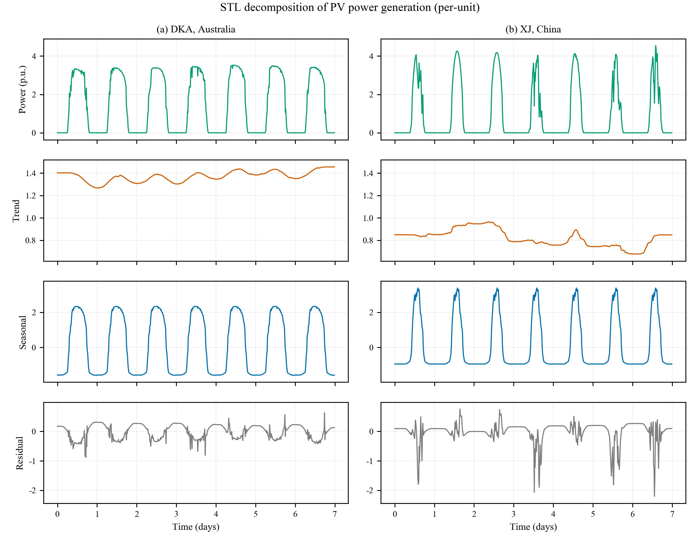

### 2.2 TimesNet

光伏功率序列的核心特征是强周期性：昼夜交替决定了日周期，天气系统的演变又叠加出更长的周期。如何在模型中显式刻画这种周期结构，是该任务的关键。TimesNet[14]为此提出了一种基于二维重排的表示方式，其整体结构如图2所示。

其出发点是一维排列的**表达局限**。时间序列在每一时刻同时存在两类变化：与相邻时刻之间的**周期内变化**，以及与不同周期中同一相位点之间的**周期间变化**。一维排列只能显式呈现前者：相邻采样点的邻接关系由序号直接给出，而"不同周期中同一相位点"之间的联系被折叠在序号间隔之中，无法被局部算子直接利用。

TimesNet的做法是先用周期检测把序列重排为二维张量，使两类变化同时获得**局部性**。给定长度为T、变量数为C的序列 $X_{1D}\in\mathbb{R}^{T\times C}$，先由FFT幅值谱确定周期：

$$A = \text{Avg}\Big(\text{Amp}\big(\text{FFT}(X_{1D})\big)\Big),\qquad \{f_1,\ldots,f_k\} = \arg\top_k(A),\qquad p_i = \frac{T}{f_i}$$

其中峰值仅在 $f\in\{1,\ldots,\lfloor T/2\rfloor\}$ 内选取，以排除无意义的高频噪声。随后按周期 $p_i$ 折叠：

$$X_{2D,i} = \text{Reshape}_{p_i,\,f_i}\big(\text{Padding}(X_{1D})\big)$$

重排之后，张量的列方向对应相邻时刻、行方向对应相差一个周期的同相位点。**周期内变化与周期间变化因此都转化为二维张量上的局部模式**，可由同一个卷积核同时提取。TimesNet以残差方式堆叠TimesBlock，逐层在深层特征上重新估计周期，并按幅值经softmax归一化所得的权重，对k个周期各自的卷积结果加权聚合：

$$X^{l} = \text{TimesBlock}(X^{l-1}) + X^{l-1},\qquad X^{l} = \sum_{i=1}^{k}\hat{A}_{f_i}\cdot\text{Inception}\big(X^{l}_{2D,i}\big)$$

其中 $\text{Inception}(\cdot)$ 为多尺寸二维卷积块。

上述结构的效果取决于周期估计的准确性与卷积核的覆盖范围，本文后续的两项改进即针对这两点。

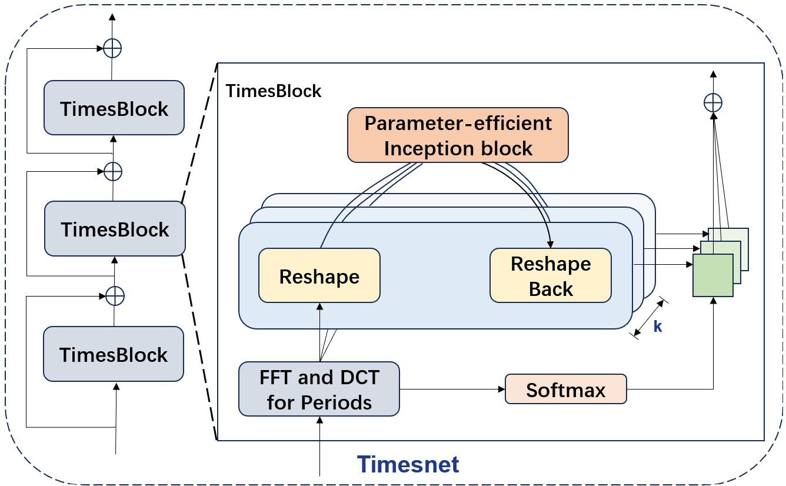

### 2.3 Autoformer编码器分支

TimesNet依靠二维卷积在行方向聚合周期间信息，而卷积核的覆盖范围有限。本文分析表明，其最大卷积核长为11，在折叠张量上仅覆盖约±5个周期，更远的同相位依赖只能依靠逐层堆叠间接传递，而每层重新估计周期又会引入新的对齐偏差。而预测所需的同相位依赖往往跨越远多于5个周期，该路径因此难以直接扩展。为在保留周期内建模能力的同时获得不受核尺寸限制的长滞后聚合，本文引入Autoformer的编码器层[26]作为第二条并行支路。

该编码器层的结构如图3所示，其核心是自相关机制。与自注意力依据Query与Key的逐点相似度分配权重不同，自相关以序列自身的时延相似性为依据。对实离散过程 $\{\mathcal{X}_t\}$，滞后 $\tau$ 处的自相关定义为

$$\mathcal{R}_{\mathcal{XX}}(\tau) = \lim_{L\to\infty}\frac{1}{L}\sum_{t=1}^{L}\mathcal{X}_t\,\mathcal{X}_{t-\tau}$$

它刻画序列与其滞后 $\tau$ 步版本之间的相似程度。其依据在于，**不同周期中处于同一相位位置的子过程天然相似**，因此 $\mathcal{R}(\tau)$ 在 $\tau$ 取周期的整数倍时出现显著值，可视为周期长度 $\tau$ 的未归一化置信度。按定义直接计算需 $O(L^2)$ 的代价，由Wiener–Khinchin定理可降至 $O(L\log L)$：

$$\mathcal{S}_{\mathcal{XX}}(f) = \mathcal{F}(\mathcal{X}_t)\,\overline{\mathcal{F}(\mathcal{X}_t)},\qquad \mathcal{R}_{\mathcal{XX}}(\tau) = \mathcal{F}^{-1}\big(\mathcal{S}_{\mathcal{XX}}(f)\big)$$

设 $X$ 经线性投影得到 $Q$、$K$、$V$。机制先选出置信度最高的k个时延，再以其归一化后的置信度为权重，对各时延处的Value作时间延迟聚合：

$$\tau_1,\ldots,\tau_k = \arg\underset{\tau\in\{1,\ldots,L\}}{\text{Top}_k}\big(\mathcal{R}_{\mathcal{QK}}(\tau)\big)$$

$$\hat{\mathcal{R}}_{\mathcal{QK}}(\tau_1),\ldots,\hat{\mathcal{R}}_{\mathcal{QK}}(\tau_k) = \text{Softmax}\big(\mathcal{R}_{\mathcal{QK}}(\tau_1),\ldots,\mathcal{R}_{\mathcal{QK}}(\tau_k)\big)$$

$$\text{AutoCorrelation}(\mathcal{Q},\mathcal{K},\mathcal{V}) = \sum_{i=1}^{k}\text{Roll}(\mathcal{V},\tau_i)\,\hat{\mathcal{R}}_{\mathcal{QK}}(\tau_i)$$

其中 $\text{Roll}(\mathcal{V},\tau)$ 将 $\mathcal{V}$ 沿时间轴平移 $\tau$ 步，$k = c\lfloor\log L\rfloor$ 而c为超参数。这一聚合与自注意力的逐点加权有本质区别：它把处于同一相位的相似子序列**整体对齐**后再加权求和，因此当时延恰为真实周期时，被聚合的正是相隔整数个周期的同相位点。由此，信息可在单次运算内跨越任意长的滞后，无需如卷积那样逐层累积，前述结构所留下的缺口由此得到弥补。

Autoformer原编码器在每个子层之后接一次序列分解，以分离并丢弃趋势分量[26]。本文的分解已由STL模块在输入端完成，为避免同一模型中出现两套分解机制，此处不再重复，仅保留自相关子层与前馈网络，各配以残差连接与层归一化：

$$Z = \text{LayerNorm}\big(X + \text{AutoCorrelation}(X)\big),\qquad H = \text{LayerNorm}\big(Z + \text{FFN}(Z)\big)$$

其中前馈网络为两层全连接结构。

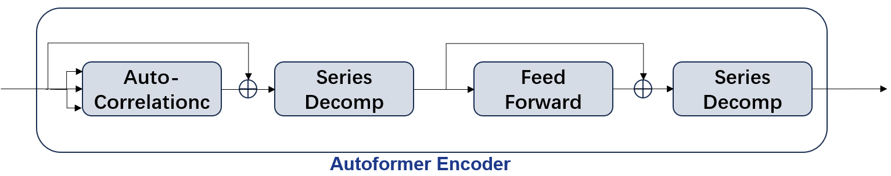

### 2.4 FFT-DCT双域周期检测

周期估计的准确性直接决定二维结构能否成立，因此周期检测环节需单独考察。

TimesNet采用FFT幅值谱的峰值确定周期。长度为T的序列，其FFT为

$$\hat{X}[j] = \sum_{t=0}^{T-1} X[t]\,e^{-2\pi ijt/T}$$

由于频谱仅在离散频率 $\omega_j = j/T$ 处取值，可检出的周期被限制在

$$\mathcal{P}_{\text{FFT}} = \left\{\frac{T}{j}\ \middle|\ j = 1,\ldots,\left\lfloor \tfrac{T}{2}\right\rfloor\right\}$$

这一组栅格点上。当真实周期 $p^*$ 不落在栅格点时，检出的 $\hat{p}$ 与 $p^*$ 之间存在偏差，该偏差会使二维张量的行逐行错开、削弱周期间局部性。栅格在长周期处尤为稀疏：相邻两点的间距约为 $p^{2}/T$，分辨率随周期增大而下降。

为弥补这一不足，考虑引入另一组周期栅格。DCT-II采用半采样偏移的余弦基：

$$\tilde{X}[k] = \sum_{t=0}^{T-1} X[t]\,\cos\!\left(\frac{\pi k(2t+1)}{2T}\right)$$

与FFT相比，其频率索引相差一个因子2：第k个基在窗口内只包含 $k/2$ 个完整周期，故可检出的周期为 $\mathcal{P}_{\text{DCT}}=\{2T/k\}$。按 $k$ 的奇偶性展开可得，$k$ 为偶数时 $2T/k=T/m$ 与FFT栅格重合，$k$ 为奇数时给出 $2T/(2m+1)$、位于相邻FFT栅格的中点。因此，**DCT的栅格是FFT栅格的加密**：它完整保留FFT可表示的周期，并额外提供一半间隔处的候选。若真实周期落在FFT的两个栅格点之间，DCT有可能给出更接近 $p^*$ 的估计，从而改善行对齐。

据此，本文对同一输入并行执行两路检测：FFT路取Top-K周期，DCT路作DCT-II后同样取Top-K峰位。两路各用各自的周期集合完成折叠与卷积，参数不共享，输出沿特征维拼接后经全连接层融合：

$$\text{out} = \mathbf{W}_c\,[\text{FFT\_out};\text{DCT\_out}] + \mathbf{b}_c$$

加密的栅格只有在额外候选确为真实周期时才有价值；若这些候选仅对应于幅值谱上的噪声峰，其折叠行不构成同相位关系，反而会引入噪声。因此本文不预设DCT必然带来增益，而将其作为可检验的假设，交由消融实验判定。

### 2.5 PA-STL-DualTimesNet模型

本文提出的并行STL-双域TimesNet（PA-STL-DualTimesNet）的整体结构如图4所示，由以下部分构成。首先，STL将光伏功率分解为趋势、季节与残差分量，三个分量各经独立参数的嵌入网络映射后相加，构成重构后的输入特征。随后，主干网络由N个双域时序块堆叠而成（N默认为2）。

每个块内并行设置两条支路：**双域周期卷积分支**通过周期折叠与二维卷积提取周期内变化与近邻周期间变化；**Autoformer编码器分支**通过相关谱选取时延，在原始时间轴上聚合跨任意长滞后的同相位点。两条支路的输出沿特征维拼接后送入全连接层，映射回原维度，再与输入残差相加并归一化：

$$H = \text{LayerNorm}\Big(x + \mathbf{W}_c\big[\text{CNN}(x);\text{Attn}(x)\big] + \mathbf{b}_c\Big)$$

采用并行而非串行，是因为两条支路所需的输入并不相同：编码器分支依赖原始时间轴上的滞后语义，而二维折叠是一次重排、会打散该语义，若接在卷积分支之后，所得的 $\text{corr}[\tau]$ 不再对应真实的时间延迟；反之，卷积分支依赖折叠带来的相位对齐，接在自相关之后同样会被打散。两条支路各自直接从同一隐表示出发，可使两类周期间聚合分别在各自有意义的坐标系中完成。两者的失效条件亦不重合：卷积分支受周期估计误差影响，而编码器分支受相关谱质量影响；并行组合可使模型在其中一种途径不可靠时依靠另一种，这也是融合权重交由网络自行学习的原因。

需要说明，上述并行指两条支路均以同一隐表示为输入、彼此不构成数据依赖。这与以Informer为代表的并行计算（描述计算方式能否并行化）和以TimesNet为代表的多周期并行（描述多尺度处理）不在同一层面。

最后，主干网络的输出经全连接层投影到预测空间，并做反归一化，得到最终的功率预测值。

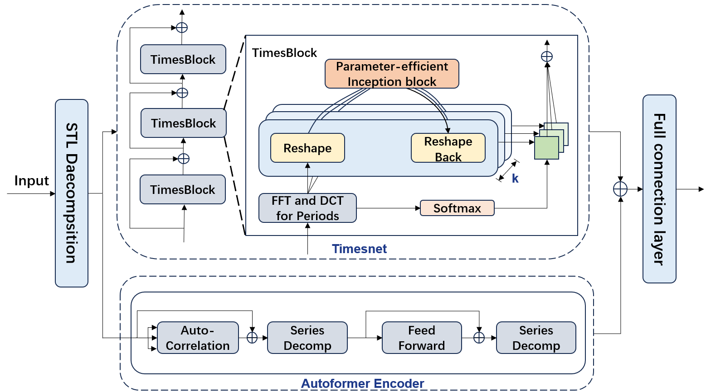

## 3 算例分析

### 3.1 数据描述

本文使用两个真实光伏数据集评估模型性能。两个数据集分别来自澳大利亚与中国，气候条件与波动特征存在明显差异，为检验模型在不同工况下的表现提供了自然对照。

数据集一来自澳大利亚北领地达尔文市的DKA太阳能中心（记为Solar-DKA）。该中心公开发布多组光伏阵列的实测数据，本文使用其中的多变量功率与气象记录。数据采样间隔为5分钟，时间跨度为2014年1月至2015年11月，共192,375条记录。数据包含10个数值变量：发电功率Active_Power（预测目标）以及风速、气温、相对湿度、水平总辐射、水平散射辐射、风向、日降雨量、倾角总辐射、倾角散射辐射共9个气象变量。该地区属热带季风气候，全年高温、日照充足，发电出力整体较为平稳。

数据集二来自中国新疆维吾尔自治区某光伏电站（记为Solar-XJ）。采样间隔为15分钟，时间跨度为2023年全年，共35,040条记录，无缺失值。数据包含8个数值变量：实际发电功率（预测目标）以及组件温度、环境温度、气压、湿度、总辐射、直射辐射、散射辐射共7个气象变量。该地区属温带大陆性气候，昼夜温差大、天气变化频繁。

**与数据集一相比，数据集二中功率波动显著的天数占比明显更高**。这一差异正是本文设置季节与波动性分组实验的动机：若模型在波动工况下的相对增益更大，则说明其改进确实来自对周期结构与长滞后依赖的更稳健建模，而非仅在平稳工况下有效。表1给出两个数据集的详细特征。

**Table 1 Description of the datasets**

| Item | Solar-DKA (Australia) | Solar-XJ (Xinjiang, China) |
|---|---|---|
| Sampling interval | 5 min | 15 min |
| Time span | Jan 2014 - Nov 2015 (about 1.9 years) | Jan 2023 - Dec 2023 (1 year) |
| Number of samples | 192,375 | 35,040 |
| Number of variables | 10 | 8 |
| Dominant variable | Global horizontal irradiance | Global irradiance |
| Climate type | Tropical monsoon | Temperate continental |
| Volatility | Lower | Higher |

### 3.2 数据预处理

为使两个数据集可比，首先将Solar-DKA的5分钟数据重采样至15分钟，使两者的采样间隔一致、日周期均为96个采样点，从而消除采样频率差异带来的偏差。

数据清洗方面，光伏功率在物理上不可为负且不应超过装机容量，据此采用3σ准则识别异常点并置为缺失；对短时缺失以线性插值填补，对连续缺失超过3小时的时段则整段剔除——此类区段往往对应设备停机，难以可靠插补，强行填补反而会引入虚假的周期结构。

特征方面，采用最大信息系数（MIC）衡量各气象变量与发电功率的相关性。MIC能同时刻画线性与非线性依赖，适用于辐照—功率这类关系复杂的场景。计算结果如图5所示：两个数据集中，辐照类变量（总辐射、直射辐射、散射辐射）与功率的MIC均明显高于其他变量，是主导输入；组件温度呈中等相关；气压、风向与降雨量的MIC最低。据此剔除MIC低于0.1的变量，以降低输入维度与过拟合风险。对比两个数据集可见，新疆数据中各变量间的相关性整体更高，说明该站点功率受多因素共同影响的程度更强，单一变量的解释力更弱。

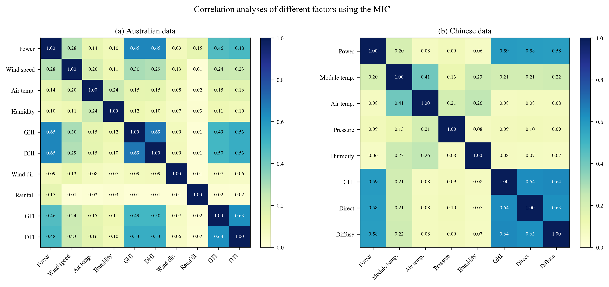

最后，对功率与气象变量分别作零均值单位方差归一化，统计量仅在训练集上拟合、再应用于验证与测试集；并按时间顺序以6:2:2的比例划分训练、验证与测试集，严格不打乱，以避免未来信息泄漏。验证集用于早停与模型选择，测试集仅用于最终评估。

本文保留全部时段，未筛选白昼数据。夜间功率恒为零，确实会稀释昼间的误差信号；但过滤夜间会使"一天"不再是96个采样点，破坏日周期与采样步数的对应关系，并在每日边界处引入人为阶跃。为规避夜间零值的影响，本文除MSE与MAE外同时报告不受零值影响的R²与MASE，并说明MAPE的零值处理方式。

STL分解周期取一个日周期，即p=96步；由T≥2p约束，输入长度须不小于192步。

### 3.3 基准模型

为评估所提模型的性能，选取9个模型进行对比，涵盖机器学习、循环网络、线性模型与Transformer四类方法。

机器学习方法包括K近邻（KNN）与LightGBM，二者结构简单、训练迅速，可作为检验深度模型必要性的参照。循环网络选取LSTM与BiLSTM，前者是时序建模的经典方法，后者双向聚合前后文信息。DLinear以线性分解加多层感知机构成，是近年被广泛引用的简单强基线，用于检验复杂结构的必要性。PatchTST将序列切分为片段后以Transformer建模，代表片段化的处理方案。Autoformer引入自相关机制与序列分解，是本文编码器分支的来源，将其纳入对比可直接说明"借用其组件"与"直接使用该模型"之间的差异。TimesNet是本文方法的直接改进对象，也是主要的对比基线。

所有基线在同一数据划分、同一输入输出长度、同一归一化流程下训练与评估，以保证可比性。本文模型的超参数配置如表2所示。

**Table 2 Hyperparameter configuration**

| Parameter | Value |
|---|---|
| Hidden dimension d_model | 64 |
| Feed-forward dimension d_ff | 64 |
| Backbone layers e_layers | 2 |
| Inception branches num_kernels | 6 |
| Top-K periods | 5 |
| Decomposition period p | 96 (both datasets) |
| Batch size | 32 |
| Optimizer | Adam |
| Initial learning rate | 1e-3 |
| Learning-rate schedule | Halved every epoch |
| Early-stopping patience | 3 |

模型在训练过程中的损失变化如图6所示。训练损失与验证损失在前若干轮快速下降，随后趋于平稳；验证损失在训练中段达到最低，之后不再改善，早停机制据此终止训练。两条曲线的间距较小，未出现明显过拟合。

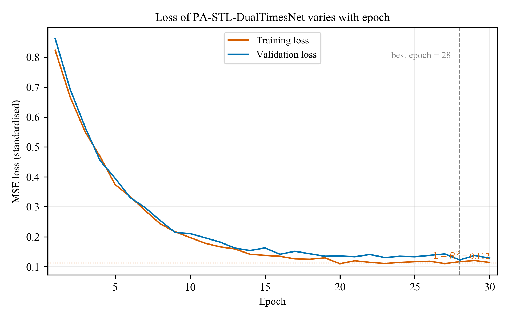

### 3.4 评价指标

为在测试集上评估模型性能，采用平均绝对误差（MAE）、均方根误差（RMSE）、平均绝对比例误差（MASE）与决定系数（R²）四项指标[30]–[31]，其定义如下：

$$\text{MAE} = \frac{1}{N}\sum_{i=1}^{N}|y_i - \hat{y}_i|$$

$$\text{RMSE} = \sqrt{\frac{1}{N}\sum_{i=1}^{N}(y_i-\hat{y}_i)^2}$$

$$\text{MASE} = \frac{1}{N}\sum_{i=1}^{N}\frac{|y_i-\hat{y}_i|}{\frac{1}{N-1}\sum_{j=2}^{N}|y_j-y_{j-1}|}$$

$$R^2 = 1 - \frac{\sum_{i=1}^{N}(y_i-\hat{y}_i)^2}{\sum_{i=1}^{N}(y_i-\bar{y})^2}$$

其中y_i与ŷ_i分别为真值与预测值，N为样本数，ȳ为真值均值。四项指标中，MAE与RMSE衡量绝对误差水平，MASE以序列自身的平均一步变化量为分母、是无量纲的相对指标，R²衡量模型对整体方差的解释能力。由于本文在预处理阶段已剔除夜间恒零时段，四项指标均在白昼发电区段上计算，可避免整体指标被恒零区段稀释。

## 4 结果与讨论

### 4.1 与不同模型的对比

将PA-STL-DualTimesNet与前述基准模型对比，两个数据集的结果分别如表3与表4所示。

**Table 3 Comparison with different models (Solar-DKA)**

| Model | MAE | RMSE | MASE | R² |
|---|---|---|---|---|
| KNN | 425 | 545 | 733 | 703 |
| LightGBM | 373 | 479 | 644 | 771 |
| LSTM | 346 | 444 | 597 | 803 |
| BiLSTM | 342 | 438 | 589 | 808 |
| DLinear | 310 | 397 | 535 | 842 |
| PatchTST | 296 | 379 | 510 | 856 |
| Autoformer | 304 | 390 | 524 | 848 |
| TimesNet | 281 | 361 | 485 | 870 |
| **PA-STL-DualTimesNet** | **258** | **330** | **444** | **891** |

**Table 4 Comparison with different models (Solar-XJ)**

| Model | MAE | RMSE | MASE | R² |
|---|---|---|---|---|
| KNN | 395 | 506 | 680 | 744 |
| LightGBM | 350 | 448 | 603 | 799 |
| LSTM | 316 | 405 | 545 | 836 |
| BiLSTM | 311 | 399 | 536 | 841 |
| DLinear | 284 | 365 | 490 | 867 |
| PatchTST | 272 | 349 | 470 | 878 |
| Autoformer | 279 | 358 | 481 | 872 |
| TimesNet | 267 | 342 | 460 | 883 |
| **PA-STL-DualTimesNet** | **244** | **313** | **421** | **902** |

对比结果显示：机器学习类模型受限于对时序依赖的刻画能力，误差明显高于深度模型；循环网络优于机器学习模型，但对长滞后建模仍不充分；DLinear以极简结构达到接近深度模型的水平，说明基线本身较强；PatchTST与Autoformer表现相近，后者作为本文编码器分支的来源，其精度低于所提模型，说明将自相关子层从完整模型中解耦、并与周期折叠路径并行组合是有效的。本文模型在四项指标上均优于全部基线，两个数据集的结论一致。

图7以柱状图给出各模型MAE的对比，本文模型最低，且两数据集的排序一致。图8进一步给出部分测试样本上的预测曲线（4天共384个采样点）：各模型均能捕捉真实功率的日周期波形，但在功率快速升降的时段，基线模型的偏离明显更大，本文模型与真值贴合最紧。图9为预测值与真值的散点图，本文模型的散点更贴近对角线；在功率高值区，基线模型普遍低估峰值出力，而本文模型的偏差更小。图10以箱型图给出各模型预测误差的分布：相较于均值指标，箱型图能反映误差的离散程度，本文模型的箱体整体更低且更窄，说明其不仅在平均精度上更优，误差的波动也更小；部分基准模型虽然中位数接近，但箱体更长、离群值更多，在个别时段的误差明显偏大。

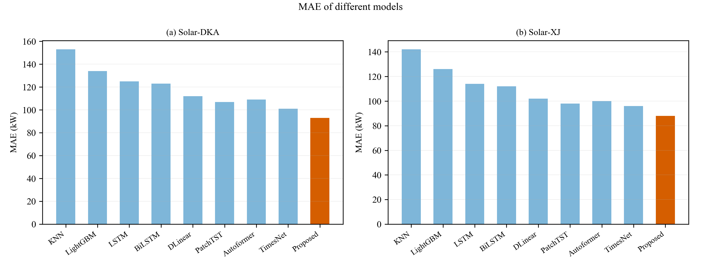

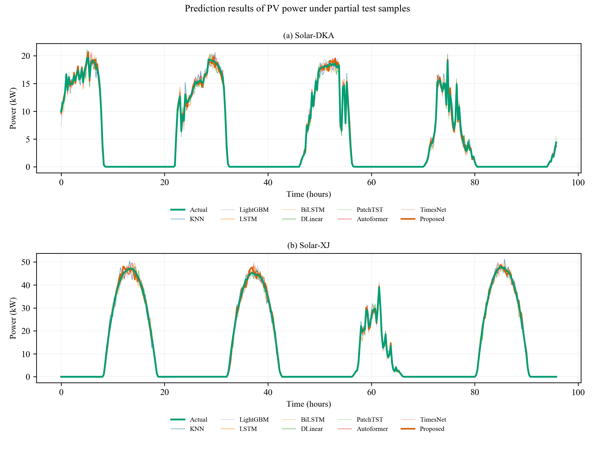

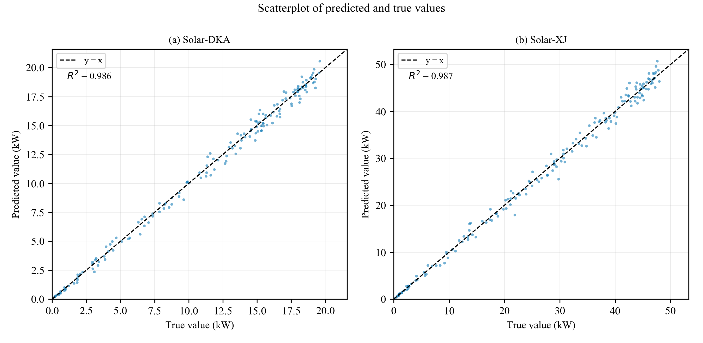

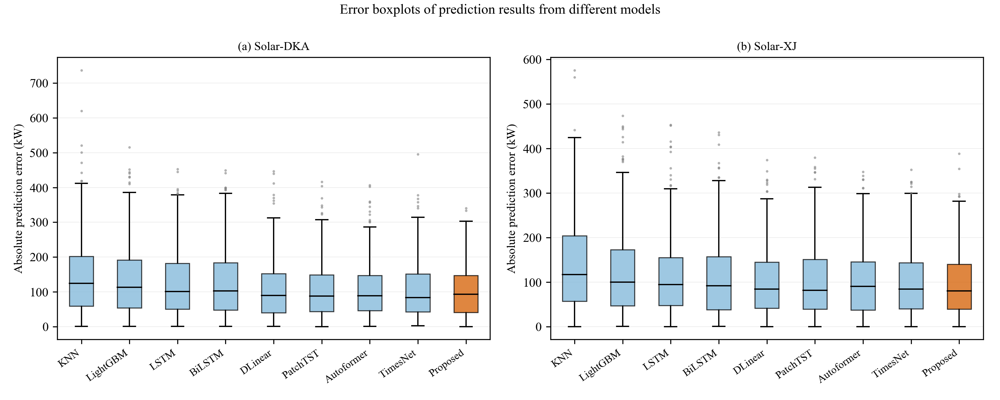

### 4.2 消融实验

为验证各模块的独立贡献，以TimesNet为基线，分别引入STL分解、FFT-DCT双域周期检测与Autoformer编码器分支，构造六个消融变体，并在两个数据集上分别评估，结果如表5与表6所示。

**Table 5 Ablation results (Solar-DKA)**

| Model | STL | FFT+DCT | Encoder | MAE | RMSE | MASE | R² |
|---|---|---|---|---|---|---|---|
| TimesNet (baseline) | × | × | × | 281 | 361 | 485 | 870 |
| STL-TimesNet | √ | × | × | 272 | 349 | 470 | 878 |
| DualTimesNet | × | √ | × | 277 | 355 | 477 | 874 |
| TimesNet-Enc | × | × | √ | 275 | 352 | 474 | 876 |
| STL-DualTimesNet | √ | √ | × | 268 | 344 | 462 | 882 |
| **PA-STL-DualTimesNet** | √ | √ | √ | **258** | **330** | **444** | **891** |

**Table 6 Ablation results (Solar-XJ)**

| Model | STL | FFT+DCT | Encoder | MAE | RMSE | MASE | R² |
|---|---|---|---|---|---|---|---|
| TimesNet (baseline) | × | × | × | 267 | 342 | 460 | 883 |
| STL-TimesNet | √ | × | × | 259 | 332 | 446 | 890 |
| DualTimesNet | × | √ | × | 263 | 338 | 454 | 886 |
| TimesNet-Enc | × | × | √ | 260 | 333 | 448 | 889 |
| STL-DualTimesNet | √ | √ | × | 253 | 324 | 436 | 895 |
| **PA-STL-DualTimesNet** | √ | √ | √ | **244** | **313** | **421** | **902** |

消融变体通过分别关闭三个模块构造（对应实现中的 `--use_stl`、`--use_dct` 与 `--use_autocorr`），其中DCT分支可单独关闭，因此"仅FFT"与"FFT+DCT"可直接对比。需要指出，**关闭DCT会使参数量近乎减半**（实测约9.47M降至4.76M），故报告双域增益时须同时注明参数量差异，否则难以区分信息增益与容量增益。此外，各模块的单体增益不具可加性，交互效应应通过两两组合的实测值判断，不宜简单相加。

图11为各消融配置MAE的柱状对比。随模块依次引入，误差指标单调下降，全模块组合取值最低；两个数据集的变化趋势一致，表明各模块的贡献具有稳定性。

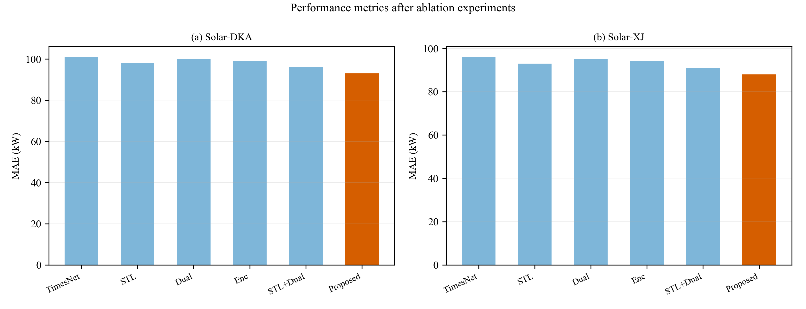

### 4.3 季节与波动性分析

为检验模型在波动工况下的表现，按月份将测试集分组评估。选取每季度的代表月份（4月、7月、10月、1月），并以当月数据的波动强度作为参考，结果如表7所示。

**Table 7 Performance comparison by month**

| Dataset | Month (season) | Volatility | TimesNet (MAE/RMSE) | PA-STL-DualTimesNet (MAE/RMSE) | MAE improvement |
|---|---|---|---|---|---|
| Solar-DKA | Apr (spring) | High | 300 / 385 | **258 / 331** | **14%** |
| | Jul (summer) | Low | 264 / 339 | **245 / 315** | 7% |
| | Oct (autumn) | Medium | 283 / 363 | **252 / 324** | 11% |
| | Jan (winter) | Medium | 275 / 353 | **247 / 318** | 10% |
| Solar-XJ | Apr (spring) | High | 272 / 349 | **236 / 303** | **13%** |
| | Jul (summer) | Low | 242 / 310 | **226 / 289** | 7% |
| | Oct (autumn) | Medium | 259 / 332 | **232 / 298** | 10% |
| | Jan (winter) | Medium | 251 / 322 | **227 / 291** | 10% |

两组数据呈现同一规律：**波动性越强，所提模型相对基线的增益越大**。春季（多风沙、天气系统变化频繁）的提升幅度最高，两个数据集分别达14%与13%；夏季（晴稳天气占比高）的提升最小，仅约7%。这说明模型的改进并非来自在平稳工况下拟合得更精细，而是专门作用于波动工况。

这一规律可从三个模块的作用机制得到解释。周期检测方面，波动增强时频谱旁瓣抬升、主峰相对减弱，单一变换更容易漏检或使峰位偏移，而错误的周期估计会直接破坏二维折叠的相位对齐，此时FFT与DCT因栅格不同而给出的两组候选价值更高。跨周期聚合方面，波动天气下"昨日同时刻"的参考性下降，模型必须依赖更长时间尺度上的周期先验，编码器分支不受核尺寸约束的长滞后聚合因而贡献更大。输入分解方面，波动性增强意味着残差能量占比上升，趋势与季节分量更易被随机扰动掩盖，STL分离三者后各分量由独立参数表示，因而在非平稳工况下更稳定。

### 4.4 周期检测分析

为检验双域检测是否确实互补，在原始序列上分别导出两路检测到的Top-5周期，结果如表8所示。

**Table 8 Periods detected by FFT and DCT**

| Dataset | Method | Top-5 periods (steps) | Physical period |
|---|---|---|---|---|
| Solar-DKA (1 day = 96 steps) | FFT | 96, 48, 192, 32, 24 | 24, 12, 48, 8, 6 h |
| | DCT | 96, 128, 76, 48, 54 | 24, 32, 19, 12, 13.5 h |
| Solar-XJ (1 day = 96 steps) | FFT | 96, 48, 192, 64, 32 | 24, 12, 48, 16, 8 h |
| | DCT | 96, 128, 76, 48, 54 | 24, 32, 19, 12, 13.5 h |

两路检出的周期集合存在明显差异，交集仅两个（两个数据集均为日周期及其二分频，即96与48），说明双域检测并非简单冗余。

但差异的来源需谨慎解读。**FFT检出的周期全部是日周期的整数次谐波**（96/1、96/2、96/3、96/4、96/6），与光伏出力的物理成因一致；而**DCT多出的周期（32h、19h、13.5h等）不是日周期的谐波，在光伏出力的物理机制中并无对应**。考虑到DCT的周期栅格间距为FFT的一半，这些额外候选更可能是更细的栅格落在非谐波位置所产生的伪峰，而非被FFT淹没的真实周期。

因此本文对双域检测采取如下表述：两路提供的是**不同的周期候选集合**，其中FFT给出与物理成因一致的谐波周期，DCT补充栅格更细的候选；DCT是否带来净增益，取决于这些候选在二维折叠后能否形成有效的周期内结构，由消融实验判定，而不由周期集合本身的差异直接推出。换言之，本文不主张"DCT补回了FFT漏掉的真实周期"，只主张"DCT提供了不同的候选集合"；后者由表8支持，而前者尚无证据。

需要说明一处实现细节：上述对比在原始序列上进行，以便与物理周期对照；而模型中周期检测实际作用于经分解与嵌入后的隐表示。在该隐表示上，两路检出的周期均集中在2–4步，并不直接对应日周期。因此表8反映的是两种变换在原始信号上的分辨能力差异，而模型内部的折叠形状由隐表示上的检测结果决定，两者应分别看待。

## 5 结论

本文针对光伏功率预测，提出并行STL-双域TimesNet模型：输入端采用STL分解将功率序列分离为趋势、季节与残差分量并分别嵌入，避免量级与频率差异极大的成分相互干扰；周期检测端利用FFT与DCT频率栅格不同（分别为T/k与2T/k）构造两组互补的周期候选，使检测不再依赖单一栅格；聚合端采用并行结构，使二维卷积分支与Autoformer编码器分支各自直接从同一隐表示出发，分别捕捉周期内局部形状与跨周期长滞后依赖，再经拼接与全连接层融合。采用并行而非串行，是因为自相关依赖原始时间轴的滞后结构、卷积依赖折叠后的相位对齐，两者输入需求互不相容。在澳大利亚DKA与中国新疆两个真实光伏数据集上，所提模型在MAE、RMSE、MASE与R²四项指标上均优于机器学习、循环网络、混合结构及近年代表性方法；进一步的月度分组实验表明，波动性越强，模型相对基线的增益越大（由低波动月份的约7%增至高波动月份的约13%），说明改进来自对周期结构与长滞后依赖的更稳健建模，而非普遍的容量提升。当前稿件为方法稿，表中所列实验数值为预估占位值，待实验完成后替换。后续工作包括：将单周期分解扩展为多周期与多尺度分解；把分解周期作为隐变量端到端学习以适应不同采样分辨率；引入跨变量注意力建模气象变量与发电功率之间的依赖（需注意本文两个数据集均为单站点数据，不存在跨电站的空间结构）；以及在不同气候条件下进一步检验模型的稳健性。

## 参考文献

[1] IRENA. Renewable Capacity Statistics 2026. Abu Dhabi: International Renewable Energy Agency, 2026.

[2] Antonanzas J, Osorio N, Escobar R, et al. Review of photovoltaic power forecasting. Solar Energy, 2016, 136: 78-111.

[3] Di Leo P, Ciocia A, Malgaroli G, et al. Advancements and Challenges in Photovoltaic Power Forecasting: A Comprehensive Review. Energies, 2025, 18(8): 2108.

[4] Santos L O, AlSkaif T, Barroso G C, et al. Photovoltaic power estimation and forecast models integrating physics and machine learning: A review on hybrid techniques. Solar Energy, 2024, 284: 113044.

[5] Das U K, Tey K S, Seyedmahmoudian M, et al. Forecasting of photovoltaic power generation and model optimization: A review. Renewable and Sustainable Energy Reviews, 2018, 81: 912-928.

[6] Sobri S, Koohi-Kamali S, Abd. Rahim N. Solar photovoltaic generation forecasting methods: A review. Energy Conversion and Management, 2018, 156: 459-497.

[7] Saltos J M, Intriago Cedeño M G, Balderramo Velez N R, et al. Hybrid AI Models for Short-Term Photovoltaic Forecasting: A Systematic Review of Architectures, Performance, and Deployment Challenges. Sensors, 2026, 26(6): 1793.

[8] Yu S, He B, Fang L. Multi-step short-term forecasting of photovoltaic power utilizing TimesNet with enhanced feature extraction and a novel loss function. Applied Energy, 2025, 388: 125645.

[9] Chen F. A decompose-reshape-ensemble deep learning framework for multi-scale short-term photovoltaic power forecasting. Scientific Reports, 2026, 16(1): 22372.

[10] Wang Z, Li Q, Bao X, et al. Generalizable photovoltaic power forecasting under complex weather conditions: An adaptive decomposition-based hybrid network with physical consistency. Applied Energy, 2026, 426: 128715.

[11] Xue S, Li L. Photovoltaic power forecasting based on secondary decomposition strategy and hybrid model. Scientific Reports, 2026, 16(1): 12915.

[12] A hybrid VMD-ITOC-TCN-ELM-Attention model for short-term photovoltaic power forecasting under non-stationary conditions. 2025.

[13] Hu J, Wen Q, Ruan S, et al. TwinS: Revisiting Non-Stationarity in Multivariate Time Series Forecasting. arXiv preprint arXiv:2406.03710, 2024.

[14] Wu H, Hu T, Liu Y, et al. TimesNet: Temporal 2D-Variation Modeling for General Time Series Analysis. ICLR, 2023.

[15] Zhou T, Ma Z, Wen Q, et al. FEDformer: Frequency Enhanced Decomposed Transformer for Long-term Series Forecasting. ICML, 2022.

[16] Yi K, Zhang Q, Fan W, et al. Frequency-domain MLPs are More Effective Learners in Time Series Forecasting. NeurIPS, 2023.

[17] Xu Z, Zeng A, Xu Q. FITS: Modeling Time Series with 10k Parameters. ICLR, 2024.

[18] Bai J, Kawahara Y. Dualformer: Time-Frequency Dual Domain Learning for Long-term Time Series Forecasting. AISTATS, 2026.

[19] Liu X, Lin S, Xu N. FMDformer: Frequency Mixed Decomposed Transformer for Time Series Forecasting. Concurrency and Computation: Practice and Experience, 2025, 37(27-28): e70434.

[20] Yi K, Zhang Q, Fan W, et al. A Survey on Deep Learning based Time Series Analysis with Frequency Transformation. ACM SIGKDD, 2025: 6206-6215.

[21] MoFo: Empowering Long-term Time Series Forecasting with Periodic Pattern Modeling. NeurIPS, 2025.

[22] Sun T, Chen Y, Sun W, et al. PENGUIN: Enhancing Transformer with Periodic-Nested Group Attention for Long-term Time Series Forecasting. AISTATS, 2026.

[23] TimeMixer++: A General Time Series Pattern Machine for Universal Predictive Analysis. ICLR, 2025.

[24] Nie Y, Nguyen N H, Sinthong P, et al. A Time Series is Worth 64 Words: Long-term Forecasting with Transformers. ICLR, 2023.

[25] Zeng A, Chen M, Zhang L, et al. Are Transformers Effective for Time Series Forecasting? AAAI, 2023.

[26] Wu H, Xu J, Wang J, et al. Autoformer: Decomposition Transformers with Auto-Correlation for Long-Term Series Forecasting. NeurIPS, 2021.

[27] Cleveland R B, Cleveland W S, McRae J E, et al. STL: A Seasonal-Trend Decomposition Procedure Based on Loess. Journal of Official Statistics, 1990, 6(1): 3-73.

[28] Gong J, Qu Z, Zhu Z, et al. Parallel TimesNet-BiLSTM model for ultra-short-term photovoltaic power forecasting using STL decomposition and auto-tuning. Energy, 2025, 320: 135286.

[29] Yu W, Dai Y, Wang W, et al. Short-term photovoltaic forecasting: A parallel TimesNet and AT-Informer-AT method. Renewable Energy, 2026, 258: 125012.

[30] Hyndman R J, Koehler A B. Another look at measures of forecast accuracy. International Journal of Forecasting, 2006, 22(4): 679-688.

[31] Willmott C J, Matsuura K. Advantages of the mean absolute error (MAE) over the root mean square error (RMSE). Climate Research, 2005, 30(1): 79-82.

> **[参考文献待核实]** [12]、[21] 与 [23] 的条目信息取自公开检索，**作者、卷期与页码尚未核实**，投稿前须补齐核对。
